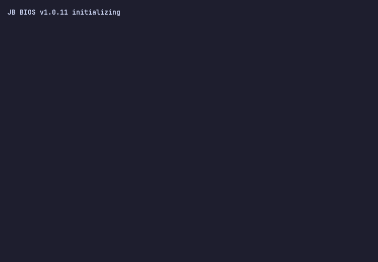

  <picture>
    <source media="(prefers-color-scheme: dark)" srcset="./output.gif">
    <source media="(prefers-color-scheme: light)" srcset="./output.gif">
    
  </picture>

  
<i>Generated automatically using <a href="https://github.com/x0rzavi/github-readme-terminal">x0rzavi/github-readme-terminal</a> (Catppuccin Mocha Theme)</i>

---
